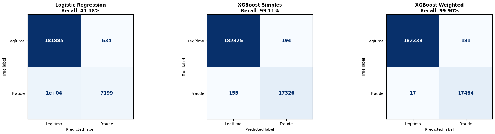

# 🛡️ Detecção de Fraude em Transações de Cartão (Cost-Sensitive)


> 📹 **Nota aos Revisores (Vídeo Explicativo)**
>
> Entendo que o volume de códigos para analisar é alto. Para otimizar seu tempo e facilitar a interpretabilidade do projeto, gravei um vídeo breve guiando-o pelo raciocínio de negócio e pela construção do pipeline.
>
> **👉 [Clique aqui para assistir ao vídeo](https://drive.google.com/file/d/1Gh-MfPP-QibS7Cc4YKn35aUKgQizZUR4/view?usp=sharing)**

---

Este projeto apresenta uma solução de Machine Learning *end-to-end* para detecção de fraudes em cartões de crédito. A abordagem foi desenhada para operar em um motor de decisão em tempo real, priorizando não apenas a métrica de acerto estatístico, mas a **minimização do prejuízo financeiro**.

---

## 1. Contexto e Objetivo de Negócio
O desafio consiste em identificar transações fraudulentas em um dataset sintético. A premissa central de negócio adotada é a de que **"aprovar uma fraude (Falso Negativo) é muito mais custoso do que negar indevidamente uma transação legítima"**.

* **Objetivo Principal:** Estancar perdas financeiras decorrentes de *chargebacks*.
* **Estratégia:** Maximizar o **Recall** (taxa de detecção), utilizando uma abordagem **Cost-Sensitive** (Sensível ao Custo) para priorizar a identificação de fraudes de alto valor monetário.

---

## 2. Principais Decisões Técnicas

Seguindo a metodologia **CRISP-DM**, as seguintes decisões estratégicas foram tomadas:

### 📊 Análise de Dados (Data Understanding)
* **O "Sinal" nos Outliers:** A análise exploratória revelou que variáveis como `ratio_to_median_purchase_price` possuem uma distribuição de cauda longa. Identificamos que os valores extremos **não eram ruídos**, mas sim características fortes de fraude. **Decisão:** Não remover outliers para preservar o sinal do comportamento fraudulento.
* **Desbalanceamento:** O dataset possui apenas ~8.7% de fraudes, exigindo métricas de avaliação robustas (não usar Acurácia).

### 🛠️ Engenharia e Pipeline (Data Preparation)
* **Pipeline Robusto:** Todo o pré-processamento foi encapsulado em um `sklearn.Pipeline` para garantir reprodutibilidade em produção.
* **Tratamento de Falhas:** Implementação de imputação de dados (Média para contínuos, Zero para binários) para garantir que o modelo não quebre caso receba dados nulos via API.
* **Escalonamento:** Uso de `MinMaxScaler` para preservar a distribuição original dos dados sem distorcer os outliers úteis.

### 🤖 Modelagem (Modeling)
Testamos três abordagens evolutivas, culminando em uma estratégia de **Pesos Híbridos**:

1.  **Baseline Linear:** Regressão Logística (para estabelecer um piso de performance).
2.  **Baseline Não-Linear:** XGBoost "Vanilla" (para capturar complexidade).
3.  **XGBoost Weighted (Cost-Sensitive)**.
    Adotamos uma estratégia de **Dupla Ponderação** durante o treinamento:
    * **Peso de Classe (`scale_pos_weight`):** Aplicado para corrigir o desbalanceamento natural do dataset (91% Legítimas vs 9% Fraudes), garantindo que o modelo dê a devida atenção à classe minoritária.
    * **Peso Financeiro (`sample_weight`):** Utilizamos a variável `ratio_to_median` como peso individual de cada transação. Isso força o algoritmo a penalizar drasticamente erros em transações de alto valor (maior prejuízo), alinhando a função de perda do modelo ao bolso da empresa.

---

## 3. Resultados Obtidos

O modelo **XGBoost Weighted** superou as outras abordagens, entregando proteção quase total do capital em risco.

### Performance Técnica (Dados de Teste)
| Modelo | Recall (Detecção) | Precision | F1-Score | ROC-AUC |
| :--- | :---: | :---: | :---: | :---: |
| Logistic Regression | 41.18% | 91.90% | 0.57 | 0.95 |
| XGBoost Simples | 99.11% | 98.89% | 0.99 | 0.99 |
| **XGBoost Weighted** | **99.90%** | 98.97% | 0.99 | 0.99 |

> **Destaque:** A validação cruzada (folds estratificados) confirmou a estabilidade do modelo com um desvio padrão ínfimo (**0.0004**), eliminando riscos de *Overfitting*.

#### Visualização Comparativa (Matriz de Confusão)
Abaixo, comparamos onde cada modelo errou. Note como o modelo final (à direita) praticamente zera os Falsos Negativos.



### Impacto Financeiro (Simulação)
Utilizando a razão do valor da compra como proxy financeiro:

| Modelo | Valor "Perdido" (Fraudes que passaram) | Redução de Perda |
| :--- | :---: | :---: |
| XGBoost Simples | 571 unidades | - |
| **XGBoost Weighted** | **88 unidades** | **~85% menor que o modelo simples** |

O modelo final deixou passar apenas 88 unidades de valor, contra 571 do modelo padrão, provando a eficácia da estratégia de pesos híbridos.

---

## 4. Plano de Deploy e Monitoramento

A produtização do modelo (MLOps) segue uma arquitetura de microsserviços para alta disponibilidade.

1.  **Empacotamento:** O pipeline treinado (Pré-processamento + Modelo) é serializado em um arquivo `.pkl`.
2.  **API de Inferência:** Desenvolvimento de uma API **FastAPI** com endpoint `POST /predict` para receber os dados da transação e retornar a probabilidade de fraude em milissegundos.
3.  **Containerização:** A aplicação é isolada em um container **Docker** para garantir paridade entre os ambientes de desenvolvimento e produção.

### Estratégia de Monitoramento
* **Data Drift:** Monitoramento contínuo da média de variáveis críticas (ex: `distance_from_home`). Desvios bruscos disparam alertas de re-treino.
* **Business KPI:** Monitoramento da **Taxa de Bloqueio**. Se o modelo começar a bloquear >20% das transações (média histórica ~8%), um *Kill Switch* é acionado para revisão manual.
* **Ciclo de Vida:** Re-treino mensal programado com os novos dados de chargebacks confirmados (Feedback Loop).

---

## 5. Como Reproduzir

1.  Clone este repositório.
2.  Instale as dependências:
    ```bash
    pip install -r requirements.txt
    ```
3.  Execute o notebook `Fraud_Detection.ipynb` para visualizar toda a análise, treinamento e validação.

---
**Autor:** Gustavo Villanova Vecchio
